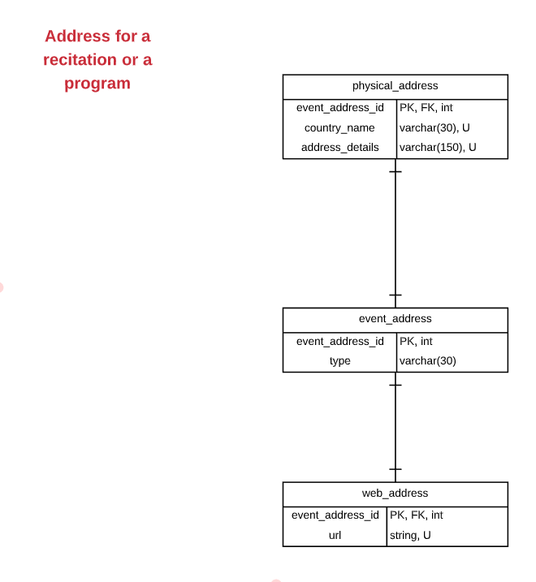

## **Event Address**

### **EVENT\_ADDRESS**

EVENT\_ADDRESS : SUPERCLASS PHYSICAL\_ADDRESS: SUBCLASS WEB\_ADDRESS: SUBCLASS

| ATTRIBUTE | DATA TYPE | DEFINITION |
| --- | --- | --- |
| event\_address\_id | INT | PK |
| type | STRING | A type is a discriminator that indicates whether the EVENT\_ADDRESS is WEB\_ADDRESS or PHYSICAL\_ADDRESS..A type is NOT UNIQUE, NOT NULL, NEVER CHANGING. |

### **PHYSICAL\_ADDRESS**

| ATTRIBUTE | DATA TYPE | DEFINITION |
| --- | --- | --- |
| event\_address\_id | INT | FK |
| country\_name | STRING | A type is a discriminator that indicates whether the EVENT\_ADDRESS is WEB\_ADDRESS or PHYSICAL\_ADDRESS..A type is UNIQUE, NOT NULL, NEVER CHANGING. |
| address\_details | STRING | An address\_details attribute is a location entered by the STAFF member for a certain event ( PROGRAM - RECITATION ).An address\_details attribute is UNIQUE, NOT NULL, CHANGING |

### **WEB\_ADDRESS**

| ATTRIBUTE | DATA TYPE | DEFINITION |
| --- | --- | --- |
| event\_address\_id | INT | PK |
| url | STRING | A url is a link entered by the STAFF member for a certain event ( PROGRAM - RECITATION ).A url is UNIQUE, NOT NULL, CHANGING. |

##
