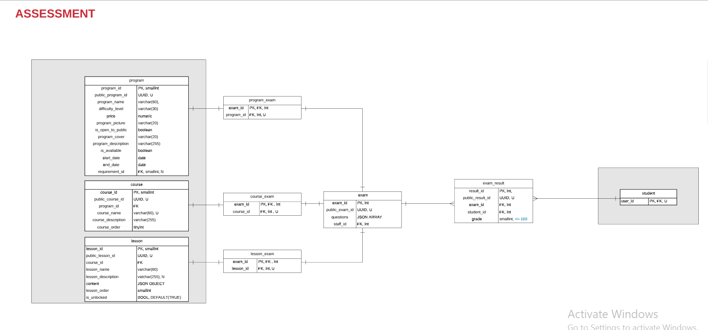
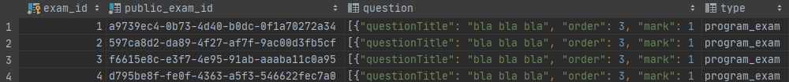
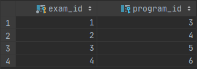
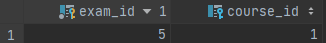
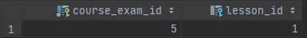

## **EXAM**



### **EXAM**


| ATTRIBUTE | DATA TYPE | DEFINITION |
| --- | --- | --- |
| exam\_id | INT | PK |
| public\_exam\_id | UUID | UNIQUE, NOT NULL NEVER CHANGING. |
| Questions | JSON OBJECT | NOT-NULL, NOT-UNIQUE, JSON ARRAY |
```
{
  "questions": "[...]"
}
```


#### _**QUESTION (JSON OBJECT)**_

| ATTRIBUTE | DATA TYPE | DATA | DEFINITION |
| --- | --- | --- | --- |
| QUESTION | JSON ARRAY | questionTitle | STRING, NOT-NULL, NOT-UNIQUE, |
|  |  | order | NUMERIC, NOT-NULL, UNIQUE |
|  |  | mark | NUMERIC, NOT-NULL. NOT-UNIQUE |
|  |  | type | MCQ WRITTEN |
|  |  | answers | JSON ARRAY |
```
{
  "questionTitle": "bla bla bla",
  "order": "3",
  "mark": "1",
  "type": "MCQ",
  "answers": [...]
}
```

#### _**MCQ QUESTION (JSON OBJECT)**_
```
{
  "answers": [...]
}
```
###

#### _**MCQ ANSWER (JSON OBJECT)**_

```
{
  "answerText": "bla bla bla",
  "isCorrect": "false"
}
```

#### _**WRITTEN QUESTION (JSON OBJECT)**_

| ATTRIBUTE | DEFINITION |
| --- | --- |
| Answer | STRING, NOT-NULL, NOT-UNIQUE |
| Optional | BOOLEAN, DEFAULT(FALSE), NOT-NULL, NOT-UNIQUE |
```
{
  "answerText": "bla bla bla",
  "isOptional": "false"
}
```
### **PROGRAM\_EXAM**


| **ATTRIBUTE** | **DATA TYPES** | **DEFINITION** |
| --- | --- | --- |
| **exam\_id** | **INT** | **PK**** FK** |
| **program\_id** | **INT** | **FK** |

### **COURSE\_EXAM**


| **ATTRIBUTE** | **DATA TYPES** | **DEFINITION** |
| --- | --- | --- |
| **exam\_id** | **INT** | **PK**** FK** |
| **course\_id** | **INT** | **FK** |

### **LESSON\_EXAM**


| **ATTRIBUTE** | **DATA TYPES** | **DEFINITION** |
| --- | --- | --- |
| **exam\_id** | **INT** | **PK**** FK** |
| **lesson\_id** | **INT** | **FK** |

### **EXAM\_RESULT**

| **ATTRIBUTE** | **DATA TYPES** | **DEFINITION** |
| --- | --- | --- |
| **exam\_result\_id** | **INT** | **PK** |
| **exam\_result\_public\_id** | **UUID** | A exam\_result\_public\_id is the unique identifier for the EXAM\_RESULT in the website.A exam\_result\_public\_id is UNIQUE, NOT NULL NEVER CHANGING |
| **student\_id** | **INT** | **FK** |
| **exam\_id** | **INT** | **FK** |
| **grade** | **SMALLINT** | **It indicates the score of the student in a specific exam and whether he passed or failed is driven from the grade in this exam ( >= 100).** |

