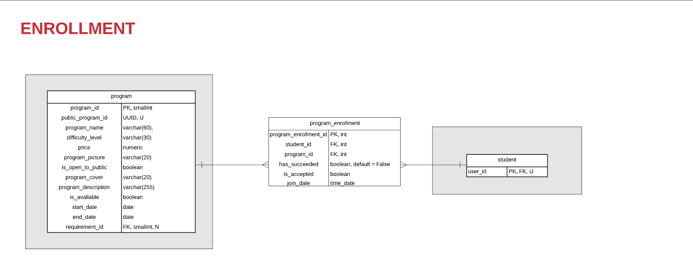

## **PROGRAM\_ENROLLMENT**

**PROGRAM\_ENROLLMENT**

| ATTRIBUTE | DATA TYPE | DEFINITION |
| --- | --- | --- |
| program\_enrollment\_id | **INT** | **PK** |
| student\_id | **INT** | **FK** |
| program\_id | **INT** | **FK** |
| has\_succeeded | **BOOLEAN** | **Indicates whether the student has succeeded in this program and has the right to get his certificate or not and also whether the program will be added to his wall of achievements.** |
| is\_accepted | **BOOLEAN** | **Indicates whether the student is accepted in the program or not if:*   - **Null → Pending**  - **True → Accepted**  - **False → Refused**|
| join\_date | **DATE** | **Represents the date when the student joined the program.** |
