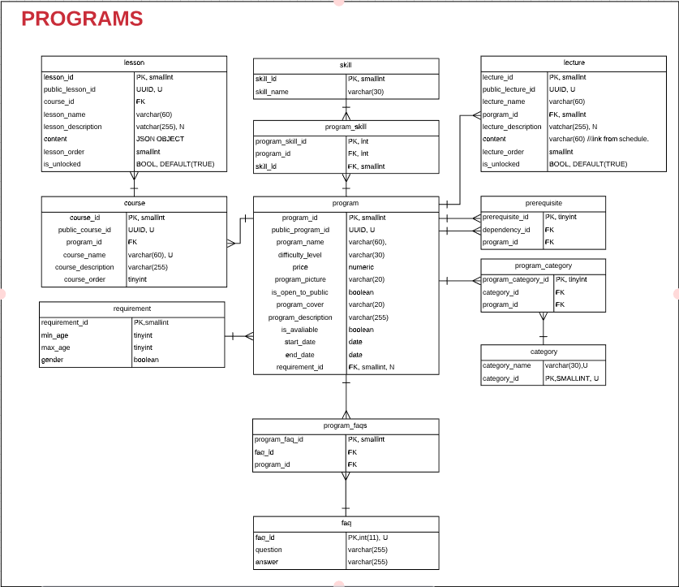
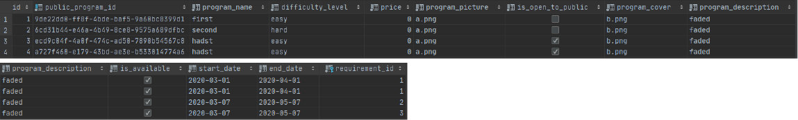
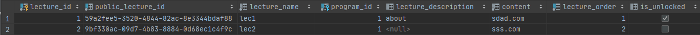
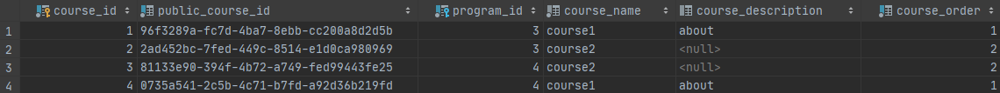
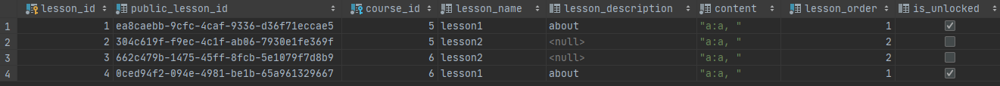
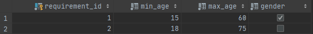
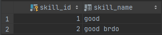
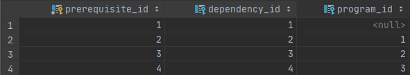
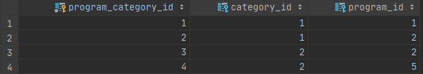
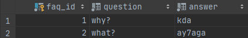

## **PROGRAMS**



### **PROGRAMS**


| ATTRIBUTE | DATA TYPE | DEFINITION |
| --- | --- | --- |
| program\_id | SMALLINT | PK |
| program\_name | STRING | A program\_name is the name of the program created by the PROGRAM SUPERVISOR.A program\_name is useful for recognizing the program from user-ends and advertising.A program\_name is CHANGING, REQUIRED, NOT UNIQUE. |
| public\_program\_id | UUID | A public\_program\_id is the unique identifier for the PROGRAM in the website..A public\_program\_id is UNIQUE, NOT NULL NEVER CHANGING. |
| difficulty\_level | STRING | A difficulty\_level is the level of difficulty of a program.A difficulty\_level is useful for telling the user the level of difficulty of the program.A difficulty\_level is NOT UNIQUE, CHANGING, REQUIRED. |
| price | NUMERIC | A price is the cost of applying for the program.A price is CHANGING , REQUIRED, NOT UNIQUE. |
| program\_picture | STRING | A program\_picture is the picture used for displaying to the end-users.A program\_picture is CHANGING, REQUIRED, UNIQUE. |
| is\_open\_to\_public | BOOLEAN | It indicates whether the PROGRAM is open to the public at the current time or not, enabling STUD ENTs to see it. |
| program\_cover | STRING | A program\_cover is a picture attached to a program horizontally to be displayed to the users.A program\_cover is CHANING, REQUIRED, UNIQUE. |
| program\_description | STRING | A program\_description is a text clarifying why you should enroll in this program and what you will learn briefly.A program\_description is CHANGING, REQUIRED, NOT UNIQUE. |
| is\_available | BOOLEAN | It clarifies whether the program is available or not.It is useful for enabling or disabling the program for enrollment.It is managed through the PROGRAM SUPERVISOR&#39;s panel.It has a default value of True.It is CHANGING , REQUIRED, NOT UNIQUE. |
| start\_date | DATE | A start\_date when the program starts.A start\_date is useful for indicating the start of time interval of applying the schedule on the PROGRAM.A start\_date is NOT UNIQUE, REQUIRED, NOT-NULL |
| end\_date | DATE | An end\_date when the program ends.An end\_date is useful for indicating the end of time interval of applying the schedule on the PROGRAM.An end\_date is NOT UNIQUE, REQUIRED, NOT-NULL |
| requirement\_id | SMALLINT | FK |

### **LECTURE**


| ATTRIBUTE | DATA TYPE | DEFINITION |
| --- | --- | --- |
| lecture\_id | SMALLINT | PK |
| public\_lecture\_id | UUID | A public\_lecture\_id is the unique identifier for the LECTURE in the website. |
| lecture\_name | STRING | A lecture\_name is the name of the lecture created by the PROGRAM SUPERVISOR.A lecture\_name is CHANGING, REQUIRED, NOT UNIQUE. |
| porgram\_id | SMALLINT | FK |
| lecture\_description | STRING | A lecture\_description is a text containing the name of the lecturer and sub points of subjects he will talk about.A lecture\_description is CHANGING, REQUIRED, NOT UNIQUE. |
| is\_unlocked | BOOLEAN | Is\_unlocked is False by default, it only turns into True due to SCHEDULE.PROGRAM SUPERVISOR could assign it to True. |

##

### **COURSE**


| ATTRIBUTE | DATA TYPE | DEFINITION |
| --- | --- | --- |
| course\_id | SMALLINT | PK |
| public\_course\_id | UUID | A public\_course\_id is the unique identifier for the course in the website.A public\_course\_id is UNIQUE, NOT NULL NEVER CHANGING. |
| program\_id | SMALLINT | FK |
| course\_name | STRING | A course\_name is the name of the course created by the PROGRAM SUPERVISOR.A course\_name is CHANGING, REQUIRED, NOT UNIQUE. |
| course\_description | STRING | A course\_description describes the content of the course and the advantages of the course along with what the student is going to learn from it.A course\_decription CHANGING, NULLABLE, NOT UNIQUE. |
| course\_order | SMALLINT | A course\_order is the order of the course within the program.A course\_order is CHANGING,NOT-NULL,NOT-UNIQUE. |

##

### **LESSON**


| ATTRIBUTE | DATA TYPE | DEFINITION |
| --- | --- | --- |
| lesson\_id | SMALLINT | PK |
| public\_lesson\_id | UUID | A public\_lesson\_id is the unique identifier for the lesson in the website.A public\_lesson\_id is UNIQUE, NOT NULL NEVER CHANGING. |
| course\_id | SMALLINT | FK |
| lesson\_name | STRING | A lesson\_name is the name of the lesson created by the PROGRAM SUPERVISOR.A lesson\_name is CHANGING, REQUIRED, NOT UNIQUE. |
| lesson\_description | STRING | TEXT, NON-NULL, VARCHAR |
| content | JSON | NOT NULL, NOT UNIQUE, CHANGING /
#####content
``` 
{
  "video": "Lorem ipsum dolor sit amet",
  "article": "Lorem ipsum dolor sit amet",
  "references":[{"title":"Lorem ipsum dolor sit amet",
                 "url" : "Lorem ipsum dolor sit amet"
               },
               {"title":"Lorem ipsum dolor sit amet",
                 "url" : "Lorem ipsum dolor sit amet"
               },
                ...],
  "html": "Lorem ipsum dolor sit amet"
} 
```

### **REQUIREMENT**


| ATTRIBUTE | DEFINITION |
| --- | --- |
| Minimum Age | NOT-UNIQUE, NUMERIC, NULLABLE |
| Maximum Age | NOT-UNIQUE, NUMERIC, NULLABLE |
| Gender | NOT-UNIQUE, BOOLEAN, NULLABLE |

### **SKILL**


| ATTRIBUTE | DATA TYPE | DEFINITION |
| --- | --- | --- |
| Skill Name | STRING | Useful for enabling the program supervisor to insert the certain set of skills he requires the students to have.NOT UNIQUE, NOT NULL, CHANGING. |

### **PREREQUISITE**


| ATTRIBUTE | DATA TYPE | DEFINITION |
| --- | --- | --- |
| prerequisite\_id | SMALLINT | PK |
| dependency\_id | SMALLINT | FK |
| program\_id | SMALLINT | FK |

### **CATEGORY**


| ATTRIBUTE | DATA TYPE | DEFINITION |
| --- | --- | --- |
| Category Name | STRING | UNIQUE, VARCHAR, NOT-NULL |

### **PROGRAM\_FAQ**

| ATTRIBUTE | DATA TYPE | DEFINITION |
| --- | --- | --- |
| program\_faq\_id | INT | PK |
| program\_id | SMALLINT | FK |
| faq\_id | INT | FK |

### **FAQ**


| ATTRIBUTE | DATA TYPE | DEFINITION |
| --- | --- | --- |
| faq\_id | INT | PK |
| question | STRING | NOT-UNIQUE, VARCHAR, NOT-NULL |
| answer | STRING | NOT-UNIQUE, VARCHAR, NOT-NULL |
