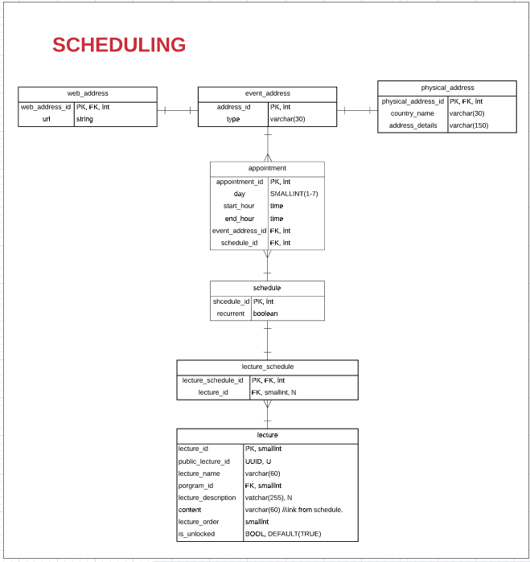

## **SCHEDULING**

## 

### **APPOINTMENT**

| ATTRIBUTE | DATA TYPE | DEFINITION |
| --- | --- | --- |
| appointment\_id | INT | PK |
| day | SMALLINT(1-7) | A day is the day in which the scheduled event takes place (not the date)A day is CHANGING ,NOT-NULL, NOT-UNIQUE. |
| start\_hour | TIME | A start\_hour is the hour at which the scheduled event starts taking place A start\_hour is CHANGING, NOT-NULL, NOT-UNIQUE (1-24), |
| end\_hour | TIME | A end\_hour is the hour at which the scheduled event is overAn end\_hour is CHANGING, NOT-NULL, NOT-UNIQUE (1-24) |
| event\_address\_id | INT | FK |
| schedule\_id | INT | FK |

### **SCHEDULE**

| ATTRIBUTE | DATA TYPE | DEFINITION |
| --- | --- | --- |
| schedule\_id | INT | PK |
| Recurrent | BOOLEAN | A recurrent attribute indicates whether the schedule is repetitive or not.A recurrent attribute is NEVER CHANGING, NOT-UNIQUE, NOT-NULL. |

###

### **LECTURE\_SCHEDULE**

| ATTRIBUTE | DATA TYPE | DEFINITION |
| --- | --- | --- |
| schedule\_id | INT | PK - FK |
| lecture\_id | SMALLINT | FK |
