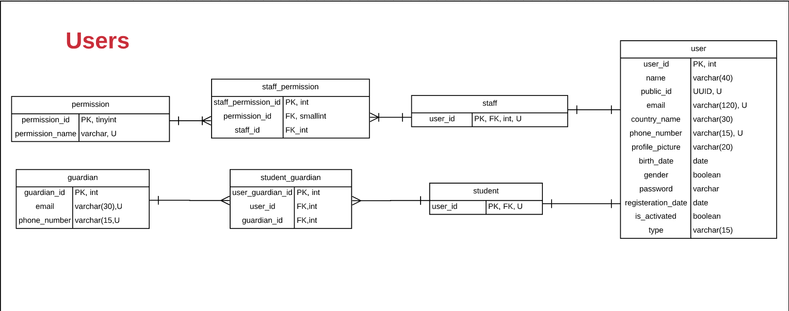

# **ATTRIBUTE DEFINITION**

## **USER**

**USER**

| ATTRIBUTE | DATATYPE | DEFINITION |
| --- | --- | --- |
| user\_id | INT | PK |
| name | STRING | A name is the first name of the owner of the account.A name is useful for interaction with the user via emails or in center, etc.A name is NOT UNIQUE.A name is REQUIRED.A name is CHANGING.A name is not a KEY CANDIDATE.|
| public\_id | UUID | A public\_id is the unique identifier for the user in the website.A public\_id is required for user authentication.A public\_id is UNIQUE, NOT NULL NEVER CHANGING. |
| email | STRING | An Email is the email that we use to communicate with the user for authentication and authorizationAn Email is UNIQUE, REQUIRED, CHANGING. |
| country\_name | STRING | A country\_name is the country the USER lives in.A country\_name is useful for real world communication with users and also PAYMENT methods and PAYMENT system.A country\_name is NOT UNIQUE,REQUIRED, CHANGING. |
| profile\_picture | STRING | A Profile Picture is a picture the user puts for other users to recognize him.A Profile Picture is NOT UNIQUE, REQUIRED, CHANGING.A Profile Picture has a default value. |
| phone\_number | STRING | A phone\_number is the phone number the user used for communication with the user.A phone\_number is UNIQUE, CHANGING, REQUIRED. |
| birth\_date | DATE | A birth\_date is the date of birth of the user.A birth\_date is useful for extracting age and being a REQUIREMENT in some of the programs.A birth\_date is NOT UNIQUE, NEVER CHANGING, REQUIRED. |
| gender | BOOLEAN | A Gender is the gender of the user.A Gender is useful for being a prerequisite in some of the programs.A Gender is NOT UNIQUE, NEVER CHANGING , REQUIRED. |
| password | STRING | A Password is the secret keyword of the user.A Password is used for user authentication.A Password is NOT UNIQUE, CHANGING, REQUIRED. |
| registeration\_date | DATE | A registeration\_date is the date when the user registered for our website.A registeration\_date is useful for offers,etcA registeration\_date is NOT UNIQUE,NEVER CHANGING,NOT NULL. |
| is\_activated | BOOLEAN | An is\_activated attribute is an attribute that indicates whether the account has been activated or not and giving access to the account to the user depends on it being activated.An is\_activated attribute is NOT UNIQUE, CHANGING, NOT NULLAn is\_activated attribute has a default value of FALSE. |
| type | STRING | A type is a discriminator that indicates whether the user is STAFF or STUDENT.A type is NOT UNIQUE, NOT NULL, NEVER CHANGING. |

### **STUDENT**

| ATTRIBUTE | DATA TYPE | DEFINITION |
| --- | --- | --- |
| user\_id | INT | FK |

### **STUDENT\_GUARDIAN**

| ATTRIBUTE | DATA-TYPE | DEFINITION |
| --- | --- | --- |
| user\_guardian\_id | INT | PK |
| user\_id | INT | FK |
| guardian\_id | INT | FK |

### **GUARDIAN**

| ATTRIBUTE | DATA-TYPE | DEFINITION |
| --- | --- | --- |
| guardian\_id | INT | PK |
| email | STRING | An email is the email of the guardian that oversees the performance of his child.An email is UNIQUE,CHANGING,NOTNULL. |
| phone\_number | STRING | A phone\_number is the phone\_number of the guardian that oversees the performance of his child.A phone\_number is UNIQUE, CHANGING, NOTNULL. |

### **STAFF**

| ATTRIBUTE | DATA-TYPE | DEFINITION |
| --- | --- | --- |
| user\_id | INT | FK |

##

### **STAFF\_PERMISSION**

| ATTRIBUTE | DATA-TYPE | DEFINITION |
| --- | --- | --- |
| user\_permission\_id | INT | PK |
| staff\_id | INT | FK |
| permission\_id | SMALLINT | FK |

### **PERMISSION**

| ATTRIBUTE | DATA-TYPE | DEFINITION |
| --- | --- | --- |
| permission\_id | INT | PK |
| permission\_name | STRING | A permission\_name is the name of the permission created by the ADMINISTRATOR to assign it to STAFF members to give them privileges to act within the website.A permission\_name is UNIQUE, CHANGING ,NOTNULL. |
